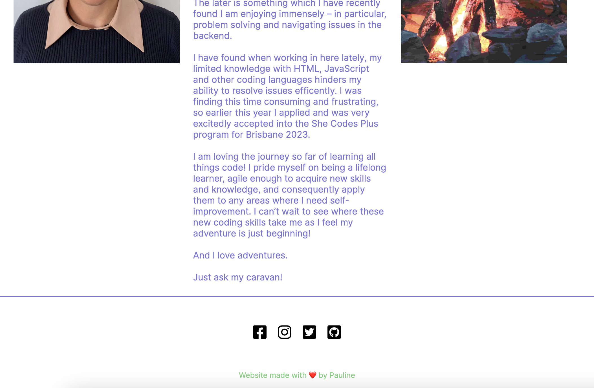
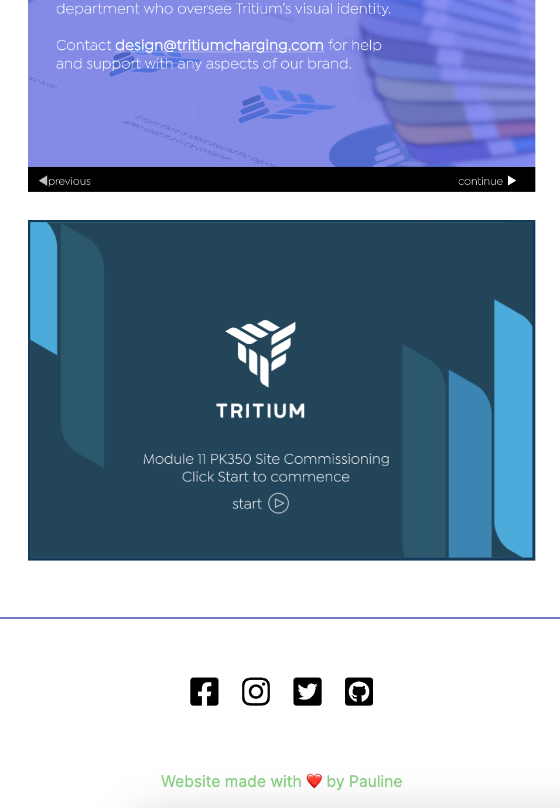

# {{ Pauline-Segi }} - Portfolio Task

[My portfolio site]( https://pauline-segi.github.io/ )

## Project Requirements

### Content
You'll find my profile picture in the 'Welcome to me!' page. This also contains a short biography including some background info and my hopes for what I'll gain with the new skills I'm learning in the She Codes Plus Program.
My contact form is on the Connect page, and you can submit a form to me using Formspree.
I have included two projects section, one for work and one for passion. I plan on building these (particularly the passion section!) as my knowledge grows. 
All the icon images are linked to their particular page (though I do have some privacy settings on the social media accounts until I get myself unique work accounts). I have also linked my name at the bottom to linkedin.
I realised I didn't work on or consider the Tablet format at all, I focused mainly on mobile, then desktop. So my tablet display properties are not even close to finish, but I will aim to get them done!
- [ ] At least one profile picture
- [ ] Biography (at least 100 words)
- [ ] Functional Contact Form
- [ ] "Projects" section
- [ ] Links to external sites, e.g. GitHub and LinkedIn.

### Technical
I've gone with 5 pages to start, though I defintetly have a lot more to go on them all. For the moment, MVP!
You'll find all my versions and commits deployed GitHub, which I was very lucky enough to have such awesome mentors spend time and help me get right on Saturday! (Thank you! Thank you! Thank you!)
I am still working on design, generally when I build online learning I am so familiar with the program I can quickly change and format things as I want, but the code certainly slowed me down and I found I couldn't do what I wanted to (not that it was impossible, just that I have nowhere near the right skills to do that just yet!) I'm not overly happy with my homepage, it's lacking something and the picture sizes were doing my head in --- but I'm getting there and it's a work-in-progress right, so I will be CQI'ing this for sure!
I really tried to use as much semantic html as I could, though I did find in certain parts I had to use div's as I was just not sure what else to call them. 
- [ ] At least 2 web pages.
- [ ] Version controlled with Git
- [ ] Deployed on GitHub pages.
- [ ] Implements responsive design principles.
- [ ] Uses semantic HTML.

### Bonus (optional)
I love the hover style! In fact, I may have gone over board with it (just a little..)
And I took what we had used in class with the JS code for the nav menu to adjust to a pop up header. So yes, didn't really have to change it too much, but am looking forward to learning more JS!
- [ ] Different styles for active, hover and focus states.
- [ ] Include JavaScript to add some dynamic elements to your site. (Extra tricky!)

### Screenshots> 
Please include the following:
> - The different pages and features of your website on mobile, tablet and desktop screen sizes (multiple screenshots per page and screen size).
> - The different features of your site, e.g. if you have hover states, take a screenshot that shows that.
>
> You can do this by saving the images in a folder in your repo, and including them in your readme document with the following Markdown code:

#### Desktop images

#### Tablet images

#### Mobile images

